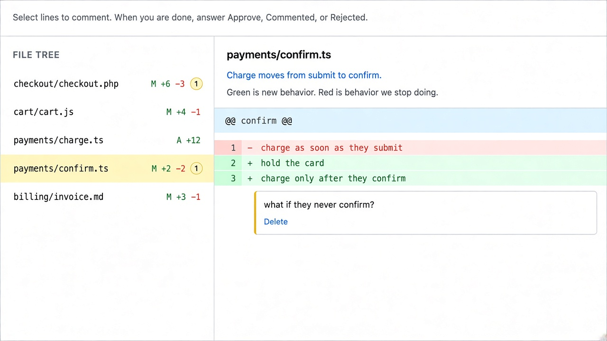

# `personal-plan-review` tip visual

#x-dev tip diagram (2026-10-04): **PR before approval** — the plan is settled; review a changes-tab sketch with a file tree, red and green pseudo-diffs (for example `confirm.ts`), inline comments, then answer Approve, Commented, or Rejected before implementation starts.
